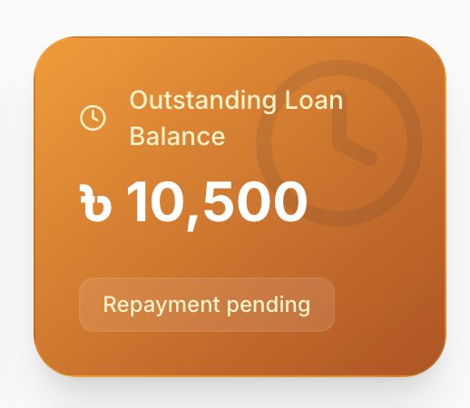

# Shopno Sonchoy - Enterprise Financial Management Platform



A comprehensive, full-stack Enterprise Financial Management Platform designed for managing members, deposits, loans, ledgers, and real-time reporting.

**Design and Development by RIzqara Tech**  
🌐 [www.rizqara.tech](https://www.rizqara.tech)

---

## 🌟 Key Features

### User & Role Management
- **Role-Based Access Control**: Separate flows and dashboards for `Admin` and `Member` accounts.
- **Member Profiles**: Dynamic auto-generated premium avatars (Dicebear) with complete KYC/profile tracking.
- **Secure Authentication**: JWT-based authentication with secure password management.

### Financial Operations
- **Monthly Collections**: Automated monthly closing system and bulk collection tracking.
- **Deposit Management**: Members can request deposits, and admins can approve/reject them.
- **Loan System**: Comprehensive loan tracking (disbursement, interest calculation, EMI generation, and repayment workflows).
- **Master Wallet**: Complete organization-level ledger tracking total funds, active investments, and cash flow.

### Real-Time & Engagement
- **Live Notifications**: WebSocket (Socket.io) integration for real-time broadcasts and system alerts.
- **Bilingual Interface**: Full English and Bengali (বাংলা) language support with instant toggling.
- **Interactive UI**: Fluid animations, transitions, and modern glassmorphic design utilizing Tailwind CSS, Radix UI, and Framer Motion.

### Reporting & Analytics
- **Dashboard Analytics**: Real-time KPI cards and charts for financial overviews.
- **Premium PDF Exports**: Automated generation of branded, highly-formatted PDF reports for Members, Loans, Deposits, and Audit Ledgers using `jsPDF`.

---

## 💻 Tech Stack

### Frontend
- **React.js (Vite)**
- **Tailwind CSS** for rapid and modern styling
- **Radix UI** for accessible, unstyled UI primitives
- **Framer Motion** for micro-animations
- **i18next** for Internationalization (i18n)

### Backend
- **Node.js & Express.js**
- **MongoDB & Mongoose** for NoSQL data modeling
- **Socket.io** for real-time bi-directional communication
- **JWT & bcrypt** for security

---

## 🚀 Getting Started

### Prerequisites
- Node.js (v18+)
- MongoDB connection URI

### Installation

1. **Clone the repository:**
   ```bash
   git clone https://github.com/royestheking-a11y/Shopno_Sonchoy.git
   cd Shopno_Sonchoy
   ```

2. **Install dependencies:**
   ```bash
   npm install
   cd server && npm install && cd ..
   ```

3. **Set up environment variables:**
   - In `server/.env`, configure your MongoDB connection:
     ```env
     PORT=5000
     MONGODB_URI=your_mongodb_connection_string
     JWT_SECRET=your_jwt_secret
     ```
   - In the root folder, create a `.env` (optional, for frontend):
     ```env
     VITE_BACKEND_URL=http://localhost:5000
     ```

4. **Run the application:**
   ```bash
   npm run dev
   ```
   This will start both the backend server and the Vite frontend concurrently.

---

## 🛠️ Deployment

The system is configured to be seamlessly deployed:
- **Frontend** is optimized for [Vercel](https://vercel.com/) (Just set `VITE_BACKEND_URL`).
- **Backend** is optimized for [Render](https://render.com/) or Heroku.

---

**© 2026 Shopno Sonchoy. Built with ❤️ by [RIzqara Tech](https://www.rizqara.tech).**